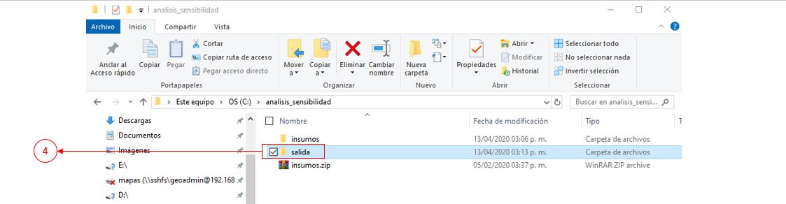

Análisis de sensibilidad
#############################

Lorem ipsum dolor sit amet, consectetur adipiscing elit. 
Aliquam at turpis lacus. Pellentesque vitae efficitur lacus. 
Proin eu lectus ultrices mauris viverra vehicula. Proin ante justo, 
ultrices eu leo ac, vulputate tristique sapien. Aenean vel enim a elit mollis commodo. 
Proin laoreet quis quam quis auctor. Vestibulum nec nisl pretium, bibendum ligula in, 
suscipit neque. Nunc placerat ac ipsum vel pellentesque. Phasellus lacinia cursus porttitor. 
Donec viverra faucibus nisl, non vestibulum quam posuere sit amet. Nulla a sodales urna. 
Donec vestibulum purus purus, iaculis pellentesque eros cursus quis. Maecenas ac maximus sem.

Descargar el código de ejemplo 

:download:`sensibilidad.py <../../codigos/sensibilidad.py>`.

Requerimientos generales 
--------------------------

Para asegurar la ejecución correcta del código es importante 
verificar la instalación y funcionamiento de los siguientes elementos:

- Qgis 3.4 o superior y librerías de Osgeo4W
- Librerías python:

 - copy
 - pprint
 - string
 - osgeo/gdal
 - gdal_calc
 - os

Requerimientos generales de los insumos
----------------------------------------

Es importante que todas las capas raster cumplan con las siguientes condiciones:

- Misma proyección cartográfica
- Mismo tamaño de pixel
- Misma extensión de capa
- Mismo valor de NoData

Ejemplo
------------

Insumos
========
Crear una (1)carpeta en el directorio raíz o en la unidad C que se llame **analisis_sensibilidad**,
para descargar los insumos hacer clic :download:`aqui <../../analisis_sensibilidad/insumos/insumos.zip>` (2)guarde el archivo **insumos.zip**
en la carpeta **analisis_sensibilidad**, posteriormente hacer clic derecho sobre el archivo  y elegir la opción (3)Extract to insumos\ 

.. image:: ../../analisis_sensibilidad/images/crear_carpeta.JPG

Una vez terminado el proceso, crear en la carpeta **analisis_sensibilidad** una (4)c arpeta con el nombre **salida**

Procedimiento
==============

1. Abrir el código
********************

Abrir el código **sensibilidad.py** en Qgis 3.4 o superior, 
Para resolver cualquier duda al respecto, consultar la guia_

.. _guia: https://vichdzgeo.github.io/geo_lancis/ejecucion.html

2. Actualizar el diccionario
*****************************

Ingresar la (1) ponderación del compontente según corresponda (Exposición, Susceptibilidad, Resiliencia), posteriormente
ingresar la (2)ponderación del subcomponente (biológico,físico), 
Ingresar el (3)nombre de la capa raster de entrada con su respectiva (4)ponderación y su (5)ruta
repita los pasos siguiendo la estructura y hasta ingresar cada una de las capas.

3. Indicar el direcctorio de salida
*************************************

Indicar el directorio donde guardarán los archivos necesarios para realizar el análisis de sensibilidad
y el archivo  **analisis_sensibilidad.csv** que contendrá los resultados.

.. code-block:: python

    p_procesamiento = 'C:/analisis_sensibilidad/salida/'

4. Ejecutar el código 
**********************

hacer clic en el (1) botón de ejecutar código, puede demorar 10 minutos o más dependiendo el procesador y 
memoria RAM que tenga el equipo en donde se ejecute, al concluir aparecerá en la (2) consola una lista que indica que
ha procesado cada una de las capas. 

.. image:: ../../analisis_sensibilidad/images/ejecucion.JPG

Bibliografía 
==============

Documentación dentro del código
==================================

.. .. automodule:: sensibilidad
..     :members: