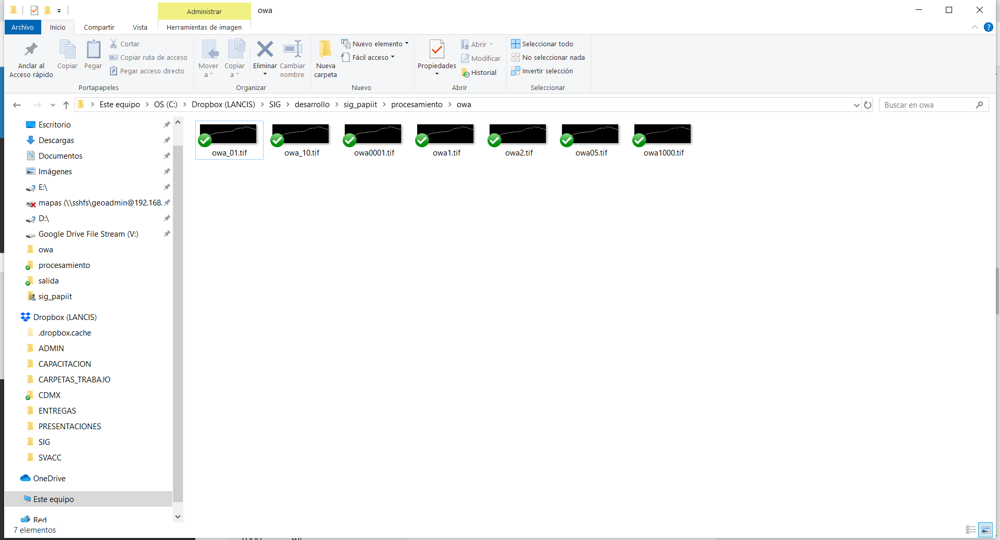

OWA
#############################

OWA (Ordered Weighted Average) es un análisis de aptitud territorial basado en procedimientos de 
Sistemas de Información Geográfica (SIG) y evaluación multicriterio (Malczewski, 2006). 
El análisis OWA genera un amplio rango de escenarios de aptitud territorial cambiando únicamente un 
parámetro lingüístico (alpha), relacionado con la rigidez en el cumplimiento de criterios preestablecidos. 

OWA está definido por la siguiente ecuación: 

.. math:: 

    OWA=\sum_{j=1}^{n}\left (\left( \sum_{k=1}^{j}u_{k}\right )^{\alpha} - \left ( \sum_{k=1}^{j-1}u_{k}\right )^{\alpha} \right )z_{ij}

Donde: 

j = Criterio 

uk = Peso ordenado del criterio j

k= Orden asignado al peso del criterio j (renglón)

i = Pixel

z_ij = Valor ordenado del criterio j en el pixel i

α = Cuantificador lingüístico 

Descargar el código de ejemplo 

:download:`owa_raster.py <../../codigos/owa_raster.py>`.

Requerimientos generales 
--------------------------

Para asegurar la ejecución correcta del código es importante 
verificar la instalación y funcionamiento de los siguientes elementos:

- Qgis 3.4 o superior y librerías de Osgeo4W
- Librerías python:

 - Numpy
 - Pandas
 - GDAL
 - reduce

Requerimientos generales de los insumos
----------------------------------------

Es importante que todas las capas raster cumplan con las siguientes condiciones:

- Misma proyección cartográfica
- Mismo tamaño de pixel
- Misma extensión de capa
- Mismo valor de NoData

Ejemplo
------------

Insumos 
========

Descargar los insumos para este ejemplo :download:`aqui <>`

Procedimiento
==============

1. Abrir el código
********************

Abrir el código **owa_raster.py** en Qgis 3.4 o superior, 
Para resolver cualquier duda al respecto, consultar la guia_

.. _guia: https://vichdzgeo.github.io/geo_lancis/ejecucion.html

.. image:: ../../owa/images/codigo.PNG

2. Actualizar el diccionario
********************************

Ingresar las capas raster de entrada con sus respectivos pesos
a la función mediante un diccionario. Es importante seguir la 
estructura del siguiente ejemplo:

.. code-block:: python

     dicc_capas = {'capa_1':{'ruta':"C:/Dropbox (LANCIS)/SIG/desarrollo/sig_papiit/entregables/exposicion/biologica/v_acuatica_yuc/fv_v_acuatica_yuc.tif",'w':0.08},
             'capa_2':{'ruta':"C:/Dropbox (LANCIS)/SIG/desarrollo/sig_papiit/entregables/exposicion/biologica/v_costera_yuc/fv_v_costera_distancia_yuc.tif",'w':0.42},
             'capa_3':{'ruta':"C:/Dropbox (LANCIS)/SIG/desarrollo/sig_papiit/entregables/exposicion/fisica/ancho_playa_yuc/fv_distancia_playa_yuc.tif",'w':0.065},
             'capa_4':{'ruta':"C:/Dropbox (LANCIS)/SIG/desarrollo/sig_papiit/entregables/exposicion/fisica/elev_yuc/fv_elevacion_yuc.tif",'w':0.435},
             }

Donde:

- **capa_#**:  Corresponde a la capa en el orden en que se agregó al diccionario,

- **ruta** : Corresponde a la ruta o path de la capa 

- **w** : Corresponde al peso asociado a esa capa o criterio 

.. note::

    Para adicionar una capa, agregar el consecutivo 
    a la llave de la capa (en este caso capa_5). 
    La línea quedaría de la siguiente forma:

    'capa_5':{'ruta':path_tiff,'w':#.###},
    }

3. Indicar la capa maestra
***************************

Para generar la salida en formato tiff se requiere conocer aspectos
técnicos como número de columnas y renglones, tamaño de pixel, coordenadas
del extent, entre otros.

Estos datos son extraidos por el código mediante la variable **path_capa_maestra**,
en ella, se indica la ruta de **cualquier** capa raster ingresada en el diccionario del 
paso #2.

como ejemplo se toma la ruta de la **capa_1** 

.. code-block:: python

    path_capa_maestra = "C:/Dropbox (LANCIS)/SIG/desarrollo/sig_papiit/entregables/exposicion/biologica/v_acuatica_yuc/fv_v_acuatica_yuc.tif"

4. Indicar el direcctorio de salida
*************************************

Indicar el directorio donde guardarán los mapas de salida. 

por ejemplo: 

.. code-block:: python

    path_salida = "C:/Dropbox (LANCIS)/SIG/desarrollo/sig_papiit/procesamiento/owa/"

5. Los valores de alpha
******************************************
El código tiene valores  predeterminados de alpha 

.. note::

    Para más información respecto a los valores de alpha consulte la 
    bibliografía

.. code-block:: python

    owa_alphas = [0.0001,0.1,0.5,1.0,2.0,10.0,1000.0]

+--------+--------------------+
|   α    |   Quantifier (Q)   |
+========+====================+
| 0.0001 | At least one       |
+--------+--------------------+
| 0.1    | At least a few a a |
+--------+--------------------+
| 0.5    | A few              |
+--------+--------------------+
| 1.0    | Half (identity)    |
+--------+--------------------+
| 2.0    | Most               |
+--------+--------------------+
| 10.0   | Almost all         |
+--------+--------------------+
| 1000   | All                |
+--------+--------------------+

para cada valor en la lista, el código generará un mapa en el directorio 
de salida 

Bibliografía
-----------------------------------
Malczewski, J. (2006). Ordered weighted averaging with fuzzy quantifiers:
GIS-based multicriteria evaluation for land-use suitability analysis. 
International Journal of Applied Earth Observation and Geoin-formation, 8 ,270-277.

Documentación dentro del código
-----------------------------------

.. .. automodule:: owa_raster
..     :members: