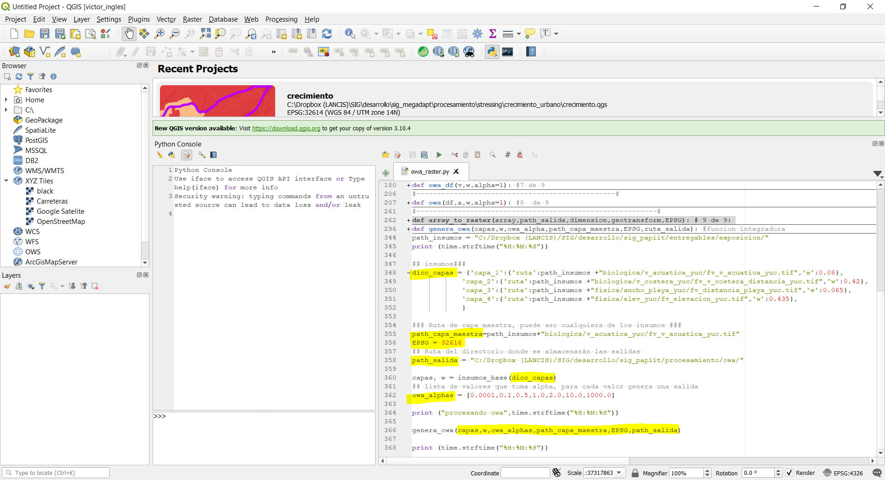

OWA
#############################

OWA (Ordered Weighted Average) es un análisis de aptitud territorial basado en procedimientos de 
Sistemas de Información Geográfica (SIG) y evaluación multicriterio (Malczewski, 2006). 
El análisis OWA genera un amplio rango de escenarios de aptitud territorial cambiando únicamente un 
parámetro lingüístico (alpha), relacionado con la rigidez en el cumplimiento de criterios preestablecidos. 

OWA está definido por la siguiente ecuación: 

.. math:: 

    OWA=\sum_{j=1}^{n}\left (\left( \sum_{k=1}^{j}u_{k}\right )^{\alpha} - \left ( \sum_{k=1}^{j-1}u_{k}\right )^{\alpha} \right )z_{ij}

Donde: 

j: Criterio 

|uk|= Peso ordenado del criterio j

k: Orden asignado al peso del criterio j (renglón)

i: Pixel

z_ij: Valor ordenado del criterio j en el pixel i

\alpha: Cuantificador lingüístico 

.. replace |uk|::
   u_{k}: 

Descargar el código de ejemplo 

:download:`owa_raster.py <../../codigos/owa_raster.py>`.

Requerimientos generales 
--------------------------

Para asegurar la ejecución correcta del código es importante 
garantizar la instalación y funcionamiento de los siguientes elementos:

- Qgis 3.4 o superior y librerías de Osgeo4W
- Librerías python:

 - Numpy
 - Pandas
 - GDAL
 - reduce

Requerimientos generales de los insumos
----------------------------------------

Es importante que todas las capas raster cumplan con las siguientes condiciones:

- Misma proyección cartográfica
- Mismo tamaño de pixel
- Misma extensión de capa

Ejemplo
------------

Insumos 
========

Descargar los insumos para este ejemplo :download:`aqui <>`

Procedimiento
==============

1. Abrir el código
********************

Abrir el código **owa_raster.py** en Qgis 3.4 o superior, 
Para resolver algun duda al respecto, visualizar la guia_

.. _guia: https://vichdzgeo.github.io/geo_lancis/ejecucion.html

2. Rellenar el diccionario
********************************

Ingresar las capas raster de entrada con sus respectivos pesos
a la función mediante un diccionario. Es importante seguir la 
estructura del siguiente ejemplo:

.. code-block:: python

     dicc_capas = {'capa_1':{'ruta':path_insumos +"biologica/v_acuatica_yuc/fv_v_acuatica_yuc.tif",'w':0.08},
             'capa_2':{'ruta':path_insumos +"biologica/v_costera_yuc/fv_v_costera_distancia_yuc.tif",'w':0.42},
             'capa_3':{'ruta':path_insumos +"fisica/ancho_playa_yuc/fv_distancia_playa_yuc.tif",'w':0.065},
             'capa_4':{'ruta':path_insumos +"fisica/elev_yuc/fv_elevacion_yuc.tif",'w':0.435},
             }

Donde:

- **capa_#**:  Corresponde a la capa en el orden en que se agregó al diccionario,

- **ruta** : Corresponde a la ruta o path de la capa 

- **w** : Corresponde al peso asociado a esa capa o criterio 

.. note::

    Para adicionar una capa, agregar el consecutivo 
    a la llave de la capa (en este caso capa_5). 
    La línea quedaría de la siguiente forma:

    'capa_5':{'ruta':path_tiff,'w':#.###},
    }

3. Indicar la capa maestra
***************************

El código transforma los datos tiff en arreglos matriciales.
Es indispensable asociar cualquier capa de los insumos
a la variable **path_capa_maestra**. 

.. code-block:: python

    path_capa_maestra = "../../*.tif"

4. Declarar el EPGS
***********************

El EPGS es el código de referencia geoespacial que indica
la proyección y el datum asociados a cada capa. Ingresar el código
EPGS correspondiente a los insumos. 
Declarar el código en la variable **EPSG** 

.. code-block:: python

    EPSG = 32616

5. Indicar el direcctorio de salida
*************************************

Indicar el directorio donde guardarán los mapas de salida. 

.. code-block:: python

    path_salida = "../../"

6. Verificar las variables asociadas a la función **insumos_base**
*******************************************************************

La función **insumos_base** recibe como parámetro el diccionario
de capas y pesos. Esta función regresa una lista de dataframes de las capas y una lista 
de pesos, por default se llaman **capas** y **w**, respectivamente.

.. note::
    
    El nombre del diccionario (establecido en el paso #2) debe coincidir 
    con el que recibe la función **insumos_base**.

.. code-block:: python

    capas, w = insumos_base(dicc_capas)

7. Indicar los valores de alpha
******************************************
El código está programado para recibir una 
lista de valores de alpha y generar 
un mapa por cada alpha declarado en dicha lista.
Declarar los valores de alpha en la variable
**owa_alphas**.

.. code-block:: python

    owa_alphas = [0.0001,0.1,0.5,1.0,2.0,10.0,1000.0]

8. Verificar que todo esté correcto en la función genera_owa
**************************************************************

La función **genera_owa** recibe las variables declaradas.

.. code-block:: python

    genera_owa(capas,w,owa_alphas,path_capa_maestra,EPSG,path_salida)

Bibliografía
-----------------------------------
Malczewski, J. (2006). Ordered weighted averaging with fuzzy quantifiers:
GIS-based multicriteria evaluation for land-use suitability analysis. 
International Journal of Applied Earth Observation and Geoin-formation, 8 ,270-277.

Documentación dentro del código
-----------------------------------

.. automodule:: owa_raster
    :members: